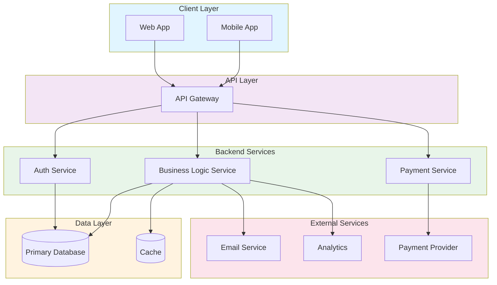

# Architecture Overview

## Components

- **Client Layer**: Web and mobile applications
- **API Layer**: Central gateway for all requests
- **Backend Services**: Microservices handling different business logic
- **Data Layer**: Database and caching layer
- **External Services**: Third-party integrations